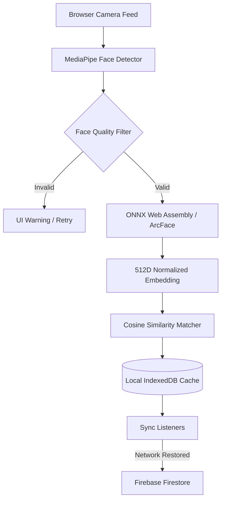

# VeriFace | Attendance. Verified.

VeriFace is a production-grade, highly accurate SaaS web application for facial recognition-based student attendance. It is designed to run entirely on a teacher's device, requiring no student phones or active internet connection to scan and verify attendance. It is ideal for NGOs, schools, tuition centers, and coaching classes.

---

## 🚀 Key Features

- **Edge AI Recognition Pipeline**: Runs face detection (MediaPipe BlazeFace) and face embedding extraction (ONNX Runtime Web + ArcFace) client-side in the browser.
- **Biometric Quality Filter**: Automatically detects blur (via Laplacian variance), illumination limits (luminance tracking), face size, and head tilt angles in real-time.
- **Interactive Pose Guidance**: Guides the user through capturing 20 high-quality face samples across multiple angles (Front, Left, Right, Up, Down, Smile, Neutral).
- **100% Offline-First (IndexedDB)**: All biometric databases, roster caches, settings, and logs reside in a browser IndexedDB, allowing attendance scanning to operate with zero active network connection.
- **Auto-Sync Engine**: Seamlessly uploads locally stored attendance sessions and records to the cloud (Firebase Firestore) as soon as connection is restored.
- **Premium SaaS Dashboard**: High-fidelity dark mode dashboards showing attendance rates, class counts, and historical analytics using interactive Recharts.
- **Excel Spreadsheet Export**: Downloads matrix sheets of students (rows) vs calendar dates (columns) with status labels using `xlsx`.
- **Security Rules**: Enforces absolute privacy between teacher sessions using strict Firestore security rules.

---

## 🛠️ Architecture & Tech Stack



- **Frontend**: Next.js 15 App Router, React 19, TypeScript, Tailwind CSS v4, Framer Motion
- **Database / Backend**: Firebase Firestore, Firebase Auth
- **AI Processing**: MediaPipe Tasks Vision, ONNX Runtime Web, ArcFace ResNet50
- **Offline Caching**: IndexedDB (`idb` wrapper)
- **Data Reports**: XLSX, Recharts

---

## ⚙️ Installation & Setup

### 1. Clone & Install Dependencies
```bash
# Clone the repository
git clone https://github.com/MeetShah0656/VeriFace.git
cd VeriFace

# Install NPM packages
npm install
```

### 2. Configure Environment Variables
Create a `.env.local` file in the root of the project:
```env
NEXT_PUBLIC_FIREBASE_API_KEY=your-firebase-api-key
NEXT_PUBLIC_FIREBASE_AUTH_DOMAIN=your-firebase-auth-domain
NEXT_PUBLIC_FIREBASE_PROJECT_ID=your-firebase-project-id
NEXT_PUBLIC_FIREBASE_STORAGE_BUCKET=your-firebase-storage-bucket
NEXT_PUBLIC_FIREBASE_MESSAGING_SENDER_ID=your-firebase-messaging-sender-id
NEXT_PUBLIC_FIREBASE_APP_ID=your-firebase-app-id
```

### 3. Firebase Security Rules Setup
Deploy the Firestore security rules located in the root `firestore.rules` file to your Firebase console.

This setup will:
1. Initialize standard collections (`teachers`, `settings`, `classes`, `students`, `face_embeddings`, `attendance_sessions`, `attendance_records`, `audit_logs`).
2. Enforce absolute privacy using strict Firestore security rules that isolate teacher data.

---

## 🖥️ Local Development

To run the Next.js development server:
```bash
npm run dev
```
Open `http://localhost:3000` to view the landing page.

---

## 💡 Try out "Local Demo Mode"

If no Firebase environment variables are provided, or if they are left at default values, the application **automatically detects this and enters Local Demo Mode**. 

- **How to Log In**: You can click the "Enter Demo Mode Directly" button, or use:
  - **Email**: `demo@veriface.app`
  - **Password**: `demo123`
- **Seeded Mock Data**: Once you enter Demo Mode, the database will automatically seed IndexedDB with mock classes (e.g. `Grade 12 - Science`), 6 student profiles, and 5 historical sessions of logs. This populates all stats cards, recents logs, and Recharts graphs instantly for you to test.

---

## 🔒 Security & Privacy

VeriFace protects biometric data through a strict security pipeline:
1. **Never Exposes Raw Embeddings**: Faces are matched locally inside the browser. Raw biometric vectors are only uploaded to the teacher's private Firestore database and are guarded by security rules checking `request.auth.uid == teacherId`.
2. **No Image Uploads**: Individual video frames or image samples are *not* stored on any cloud storage (except optional student roster photos if configured). Only the 512 float values of mathematical features (embeddings) are saved.
3. **Audit Trail**: Every CRUD and synchronization action generates secure entries inside the `audit_logs` table.
